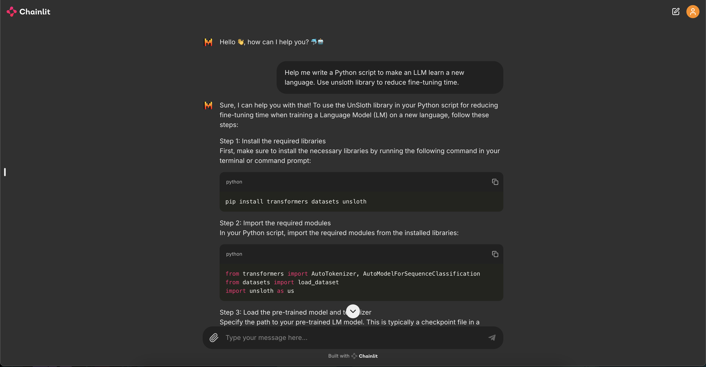

# Dolphin-Mistral LLM: Local Implementation 🐬🇫🇷

Local implementation of the Dolphin-Mistral LLM using Ollama and Chainlit

## 🗂️ Prerequisites
- Ollama installed

## ⚙️ Installation and Running
1. Install Dolphin-Mistral from Ollama [here](https://ollama.com/library/dolphin-mistral)
2. Install all the requirements running: `pip install -r requirements.txt`
3. Run the app! `chainlit run app.py --port 5554`

## 🐬 Demo 

